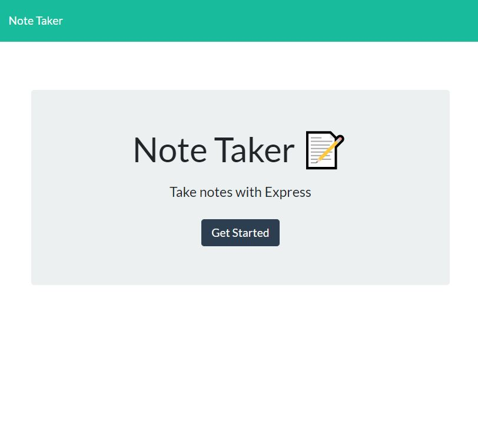
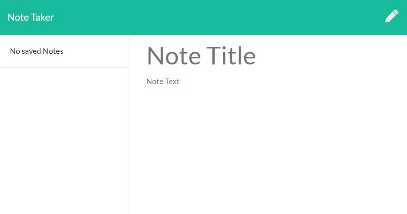
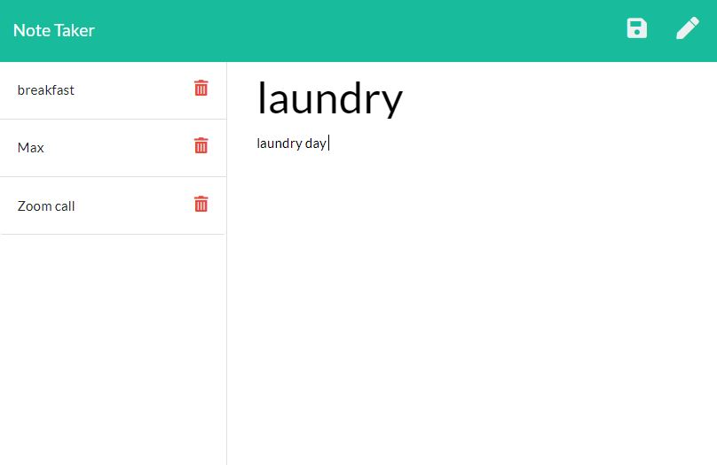
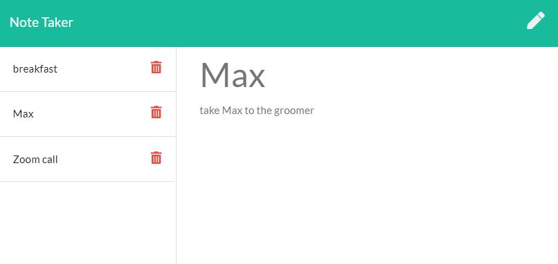
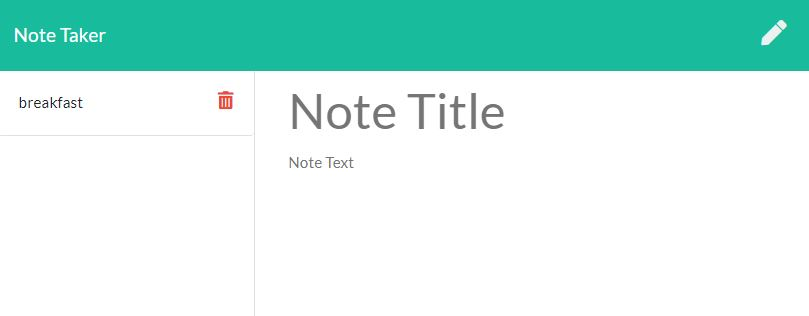

# 🏆 Note Taker 🏆

##### **Badge:**

## **Description:**
* Since it is easy to forget daily task, Note taker has been created to help keeping tracking of these forgetable tasks.

## **Table of Contents:**
1. [Installation](#installation)
2. [Usage](#usage)
3. [Contribution](#contribution)
4. [Test](#test)
5. [Questions](#questions)
6. [Link](#link)
7. [Screenshots](#screenshots)

## **Installation:**
* run `node server` on the command line and then open up `localhost:"***"/`  to interact with the app on the browser

## **Usage:**
* For keeping track of daily activities at home, work or school.

## **Contribution:**
* Anyone who is working on a programming project, especially if you want others to use it or contribute

## **Test:**
* You will need to use GitHub and Heruko... Please contact me for details.

### **Questions:**
* williams@wf.com

### **Link:**
* [GitHub] - https://github.com/williamsffc

## **Screenshots:**

-------------
© Copyright - 2020

